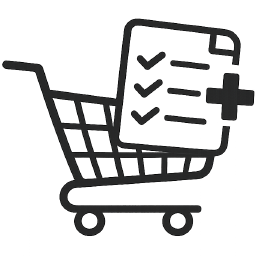

#  Shopping List Plus

Integrácia nákupného zoznamu pre Home Assistant s vlastným **panelom**, **kartou pre dashbaord**, **skenerom čiarových kódov** a podporou produktov s variantmi.

---

## Funkcie

- **Vlastný panel** — plnohodnotný správca produktov priamo v HA
- **Dashboard karta** — plne uživateľsky upraviteľná kompaktná karta pre dashboard, umožňuje zobraziť všetko alebo kategórie produktov, zobrazuje nákupny zoznam s extra funkciami
- **Skener čiarových kódov v karte** — cez kameru mobilu (zatiaľ len Android Companion app), známe čiarové kódy pridáva do nákupného zoznamu, neznáme pridáva do databázy produktov
- **Skener čiarových kódov v panely** — cez kameru mobilu (zatiaľ len Android Companion app), na známe čiarové kódy upozorní, neznáme pridáva do databázy produktov
- **Produkty s variantmi** — umožňuje vyplniť rôzne varianty produktu, rôznych výrobcov rovnakého produktu, kusy, objem alebo urobiť skupinu podobných produktov, napr. "Kuriacie mäso" varianty - "Krídla", "Stehná", umožňuje pridadiť viac čiarovýc hkódov k jednému variantu
- **Obľúbené položky** — rýchly prístup k často kupovaným produktom
- **Kategórie** — farebné kategórie s drag & drop zoradením
- **Nákupný režim** — zjednodušené zobrazenie dashboard karty pri nakupovaní - ručne alebo automatizáciou
- **Vlastné ikony produktov** — vo formáte PNG, JPG, GIF, SVG, WEBP

---

## Požiadavky

- Home Assistant 2024.1.0 alebo novší
- [Home Assistant Companion App](https://companion.home-assistant.io/) (pre skener a notifikácie)

---

## Inštalácia

### Manuálna inštalácia

1. Stiahni poslednú verziu.
2. Skopíruj `custom_components/shopping_list_plus/` do `/config/custom_components/`
3. Skopíruj `www/community/shopping-list-card/` do `/config/www/community/`
4. Reštartuj Home Assistant
5. Pridaj integráciu: **Nastavenia → Zariadenia & služby → Pridať integráciu → Shopping List Plus**

### Cez HACS

1. Otvor HACS → **Vlastné repozitáre**
2. Pridaj URL: `https://github.com/GegoSK/shopping-list-plus`
3. Kategória: **Integrácia**
4. Nainštaluj **Shopping List Plus**
5. Reštartuj Home Assistant

---

## Konfigurácia

Pri pridávaní integrácie vyplň:

| Pole | Popis | Predvolené |
|------|-------|---------|
| **Nákupný zoznam** | HA `todo` entita | — |
| **Webhook ID** | Vlastný unikátny ID pre príjem čiarových kódov. Predvolený je treba zmeniť | `shopping_barcode_scan` |
| **Súbor produktov** | Cesta k JSON databáze | `/config/shopping_favorites.json` |
| **Priečinok ikon** | Cesta k vlastným ikonám | `/config/custom_components/shopping_list_plus/icons` |
| **Notify služba** | Companion app služba pre TTS/vibrácie | — |

---

## Dashboard karta

Pridaj kartu do dashboardu cez UI alebo vlož do yaml:

```yaml
type: custom:shopping-list-card
accent_color: "#4fbce3"
show_favorites: true
show_add_input: true
show_list: true
show_completed: false
show_icons_in_list: true
show_category_badge: true
sort_by_category: true
grid_columns: 6
purchase_delay: 3
accent_text_color: "#ffffff"
show_nocat: true
show_cart_icon: true
show_shopping_mode_btn: true
product_size: s
icon_size: m
variant_select_delay: 2

```

### Možnosti karty

| Možnosť | Popis | Predvolené |
|---------|-------|---------|
| `product_size` | Výška tlačidiel `s/m/l` | `m` |
| `icon_size` | Veľkosť ikon `s/m/l` | `m` |
| `grid_columns` | Počet stĺpcov produktov | `4` |
| `purchase_delay` | Oneskorenie presunu kúpených (s) | `3` |
| `variant_select_delay` | Čas na výber variantov (s) | `3` |
| `accent_color` | Farba zvýraznenia | — |
| `show_cart_icon` | Ikona košíka pri kúpenom | `true` |
| `show_icons_in_list` | Ikony v nákupnom zozname | `false` |

---

## Skener čiarových kódov

Integrácia prijíma čiarové kódy cez webhook. Companion app posiela POST request:

```json
{
  "barcode": "1234567890",
  "name": "Mlieko"
}
```

Ak je čiarový kód známy — produkt sa automaticky pridá do nákupného zoznamu.
Ak nie — uloží sa do **Pending** zoznamu na neskoršie priradenie k existujúcemu alebo novému produktu.

Nacitaný čiarový kód sa posiela cez Event (shopping_list_plus_barcode_scanned), ktorý je možné využiť v automatizáciach. Napríklad: 

```yaml
triggers:
  - trigger: event
    event_type: shopping_list_plus_barcode_scanned
actions:
  - action: rohlikcz.add_to_cart
    data:
      barcode: "{{ trigger.event.data.barcode }}"
```
---

## Odozva pri skenovaní

Nastaviteľné v paneli → **Nastavenia**:

| Typ | Popis |
|-----|-------|
| **Zvuk** | Web Audio — priamo v karte/paneli |
| **Vibrácia** | Cez Companion app notifikáciu |
| **TTS** | Hlasové oznámenie cez Companion app |

Samostatne nastaviteľné pre **nájdený** a **neznámy** čiarový kód.


---

## Preklady

Ak chcete mať integráciu vo vlastnom jazyku, preložte texty v súbore **translations/en.json** a zdieľajte. 

---

## Claude

Táto integrácia bola vytvorené s pomocou Claude AI. 

---
## Licencia

MIT License — voľné použitie a úpravy.
